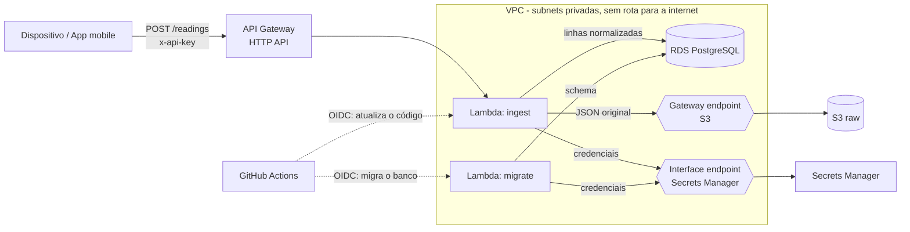

# Serverless Ingest Pipeline

API HTTP que recebe lotes de leituras de dispositivos, guarda o payload original no S3, normaliza os dados e os grava em PostgreSQL. Tudo roda em AWS Lambda dentro de uma VPC privada e é provisionado com Terraform.

O projeto reproduz um padrão que construí no trabalho (app mobile → Lambda → S3 → banco de dados), refeito aqui com um domínio genérico para que o código possa ser público.

## Arquitetura



Fluxo de uma requisição:

1. O API Gateway aplica throttling e encaminha a requisição para a Lambda `ingest`.
2. A Lambda compara o header `x-api-key` com um segredo no Secrets Manager.
3. O corpo é validado com Zod. Lotes inválidos são rejeitados com `400`, indicando os campos com erro.
4. O corpo original é gravado em `s3://<bucket>/raw/AAAA/MM/DD/<requestId>.json`.
5. As leituras são normalizadas (temperatura para °C, pressão para hPa, datas para UTC).
6. As linhas são inseridas em um único comando com `ON CONFLICT (idempotency_key) DO NOTHING`, então reenvios do dispositivo nunca geram duplicatas.

## API

`POST /readings`

```json
{
  "readings": [
    {
      "idempotencyKey": "3f9c1d3e-7a4b-4e39-9b41-6c9d1f0a2b11",
      "deviceId": "sensor-01",
      "metric": "temperature",
      "value": 78.8,
      "unit": "F",
      "recordedAt": "2026-01-15T10:30:00Z"
    }
  ]
}
```

| Campo | Regras |
| --- | --- |
| `readings` | de 1 a 100 itens |
| `idempotencyKey` | UUID, único por leitura |
| `deviceId` | de 1 a 64 caracteres: letras, dígitos, `_` e `-` |
| `metric` | `temperature` (C, F, K), `humidity` (%), `pressure` (hPa, kPa), `battery` (%) |
| `recordedAt` | ISO 8601 com fuso, no máximo 5 minutos no futuro |

| Status | Significado |
| --- | --- |
| `201` | Pelo menos uma leitura foi inserida |
| `200` | Lote válido, mas todas as leituras já tinham sido recebidas |
| `400` | JSON malformado ou erros de validação |
| `401` | Chave de API ausente ou incorreta |
| `500` | Falha inesperada (os detalhes vão para os logs, nunca para o cliente) |

Corpo da resposta: `{ "received": 1, "inserted": 1, "duplicates": 0 }`

## Decisões de projeto

**Rede privada, sem NAT gateway.** As Lambdas e o banco ficam em subnets privadas, sem rota para a internet. O S3 é acessado por um gateway endpoint (gratuito) e o Secrets Manager por um interface endpoint. Os security groups liberam apenas os fluxos necessários: Lambda para o banco na porta 5432 e Lambda para os endpoints na 443.

**Payload original primeiro, banco depois.** Guardar o JSON original no S3 permite reprocessar os dados quando as regras de normalização mudarem. Se o insert no banco falhar depois da escrita no S3, sobra um objeto órfão, o que é inofensivo em uma landing zone e expira por uma regra de lifecycle.

**Idempotência no banco.** Espera-se que os clientes façam retry. Uma constraint única em `idempotency_key` torna os reenvios seguros sem precisar de nenhum estado extra.

**Núcleo testável.** A lógica do handler em `src/core/ingest.ts` recebe suas dependências (storage, banco, relógio, busca de segredos) como argumentos. Os arquivos em `src/handlers/` apenas ligam as implementações reais de AWS e PostgreSQL, então os testes rodam sem mockar módulos e sem tocar na AWS.

**Migrações como Lambda.** O banco não tem acesso público, então as mudanças de schema rodam de dentro da VPC. A função `migrate` aplica os arquivos SQL pendentes dentro de uma transação, protegida por um advisory lock para que duas execuções não se sobreponham, e registra o que foi aplicado em `schema_migrations`.

**Infraestrutura e código são implantados separadamente.** O Terraform cuida da infraestrutura. O GitHub Actions apenas atualiza o código das funções (`lambda update-function-code`) e roda as migrações antes. Os recursos Lambda ignoram `source_code_hash` para que o Terraform não desfaça um deploy de código.

**Sem chaves AWS de longa duração no GitHub.** O workflow de deploy assume uma role IAM via GitHub OIDC. A role confia apenas na branch `main` deste repositório e só pode atualizar e invocar as duas funções.

**TLS com verificação de certificado.** A conexão com o banco valida o certificado do servidor contra o bundle de CAs do RDS, em vez de desativar a verificação.

### Perguntas que este projeto responde

**Por que TypeScript e não Java?** Minha stack principal é Java, mas para uma função Lambda escolhi Node.js com TypeScript. O runtime inicia mais rápido (cold start menor) e consome menos memória, o que pesa em serverless, onde qualquer invocação pode cair em um ambiente novo. Uma Lambda em Java com Spring Boot precisaria de recursos como SnapStart ou GraalVM para chegar perto disso. O TypeScript ainda entrega tipagem estática, e o Zod valida em tempo de execução os dados que chegam de fora.

**Por que PostgreSQL e não DynamoDB?** Os dados são relacionais e consultados com filtros e agregações por dispositivo, métrica e período, o que o SQL faz bem, com o índice em `(device_id, metric, recorded_at DESC)`. A constraint única da idempotência também é nativa. O DynamoDB seria mais barato e escalaria melhor para volumes muito altos de escrita com padrões de acesso conhecidos, mas exigiria modelar as consultas de antemão. A contrapartida do RDS é o custo fixo por hora e a necessidade de uma VPC.

**Por que VPC endpoints e não um NAT gateway?** A Lambda precisa falar com o banco, que fica na VPC, e também com o S3 e o Secrets Manager. Um NAT gateway resolveria isso, mas tem custo fixo por hora mais o tráfego processado, e abriria uma saída para a internet que a função não precisa. O endpoint do S3 é gratuito. O do Secrets Manager cobra por hora, em geral menos que um NAT, e mantém todo o tráfego dentro da rede da AWS.

**Como a idempotência é garantida?** Cada leitura carrega um UUID gerado pelo cliente (`idempotencyKey`). O banco tem uma constraint única nessa coluna e o insert usa `ON CONFLICT DO NOTHING`, então a garantia fica no banco e vale mesmo com várias Lambdas rodando ao mesmo tempo. Usar um hash do conteúdo seria uma alternativa, mas duas leituras legítimas e idênticas poderiam ser confundidas com um reenvio.

## Estrutura do repositório

```
app/
  src/core/       validação, normalização, lógica de ingestão, repositório, runner de migrações
  src/handlers/   pontos de entrada das Lambdas (ingest, migrate)
  src/lib/        config, logs, segredos, clientes S3 e banco
  src/local/      servidor HTTP para rodar a API sem AWS
  migrations/     arquivos SQL
  test/           testes unitários e test/integration (PostgreSQL real)
docker-compose.yml  PostgreSQL para desenvolvimento e testes
infra/            Terraform (rede, banco, storage, Lambda, API, role de deploy)
scripts/          script para enviar uma requisição de exemplo
.github/workflows/  CI e deploy
```

## Testes e execução local (sem AWS)

Requisitos: Node.js 22 e Docker.

**Testes unitários.** São 25 testes que rodam sem rede e sem banco:

```bash
cd app
npm ci
npm test
```

**Testes de integração.** Rodam contra um PostgreSQL real e cobrem o que os testes unitários não alcançam: as migrações, o `ON CONFLICT` da idempotência (lote repetido, lote parcialmente repetido e chave repetida dentro do mesmo lote) e o handler completo gravando de verdade no banco. Cada execução cria um schema temporário e o remove no final, então dados existentes no banco não são tocados.

```bash
docker compose up -d postgres
cd app
npm run test:integration
```

**API local.** O mesmo handler roda atrás de um servidor HTTP simples. Localmente o payload original é gravado em `app/.local/raw/`, no lugar do S3, e o banco é o PostgreSQL do Compose (porta 5433).

```bash
docker compose up -d postgres
cd app
npm run dev
```

Em outro terminal, no Linux, macOS ou Git Bash:

```bash
export API_URL=http://localhost:3000
export API_KEY=local-dev-key
./scripts/send-sample.sh
```

No Windows PowerShell:

```powershell
.\scripts\send-sample.ps1
```

Sem parâmetros, o script usa `http://localhost:3000` e `local-dev-key`. Para apontar para outro endereço: `.\scripts\send-sample.ps1 -ApiUrl <url> -ApiKey <chave>`.

Variáveis opcionais do servidor local: `PORT`, `API_KEY`, `RAW_DIR` e `DATABASE_URL`. As migrações são aplicadas automaticamente na inicialização.

## Como executar na AWS

Requisitos: Node.js 22, Terraform 1.6+ e AWS CLI com credenciais de uma conta de testes.

**1. Baixe o bundle de CAs do RDS** (é público e é embutido na Lambda):

```bash
curl -o app/certs/rds-global-bundle.pem https://truststore.pki.rds.amazonaws.com/global/global-bundle.pem
```

No PowerShell, `curl` é um alias de outro comando, então use:

```powershell
Invoke-WebRequest -Uri https://truststore.pki.rds.amazonaws.com/global/global-bundle.pem -OutFile app\certs\rds-global-bundle.pem
```

**2. Teste e gere o build das funções**

```bash
cd app
npm ci
npm run typecheck
npm test
npm run build
```

**3. Provisione a infraestrutura**

```bash
cd ../infra
cp terraform.tfvars.example terraform.tfvars   # ajuste github_repository
terraform init
terraform apply
```

**4. Crie o schema do banco**

```bash
aws lambda invoke \
  --function-name "$(terraform output -raw migrate_function_name)" \
  --cli-binary-format raw-in-base64-out --payload '{}' response.json
cat response.json
```

**5. Envie uma requisição**

```bash
export API_URL="$(terraform output -raw api_url)"
export API_KEY="$(aws secretsmanager get-secret-value \
  --secret-id "$(terraform output -raw api_key_secret_arn)" \
  --query SecretString --output text)"

../scripts/send-sample.sh
```

No PowerShell:

```powershell
$env:API_URL = terraform output -raw api_url
$env:API_KEY = aws secretsmanager get-secret-value `
  --secret-id (terraform output -raw api_key_secret_arn) `
  --query SecretString --output text

..\scripts\send-sample.ps1
```

O script envia a mesma leitura duas vezes; a segunda resposta a reporta como duplicada.

**6. Habilite os deploys pelo GitHub**

Nas configurações do repositório, adicione estas variáveis de Actions:

| Variável | Valor |
| --- | --- |
| `AWS_REGION` | a região usada no Terraform |
| `AWS_DEPLOY_ROLE_ARN` | `terraform output github_deploy_role_arn` |
| `PROJECT_NAME` | somente se você alterou `project_name` |

Pushes na `main` que alterarem `app/` vão testar, compilar, migrar e implantar.

**7. Limpeza**

```bash
terraform destroy
```

## Custo

O banco (`db.t4g.micro`) e o interface endpoint do Secrets Manager são cobrados por hora, então rode `terraform destroy` quando terminar de experimentar. O uso de Lambda, API Gateway e S3 é desprezível nessa escala.

## Limitações conhecidas e próximos passos

- As Lambdas conectam com o usuário master do RDS. Uma role de banco dedicada, com privilégios mínimos, seria melhor.
- O state do Terraform é local. Um backend remoto (S3 com locking) é o próximo passo para uso compartilhado.
- O endpoint do Secrets Manager fica em apenas uma zona de disponibilidade.
- Não há dead-letter queue: uma requisição que falha é devolvida ao cliente, que tenta de novo com a mesma chave de idempotência.
- Adicionar alarmes do CloudWatch para erros de Lambda e respostas 5xx.